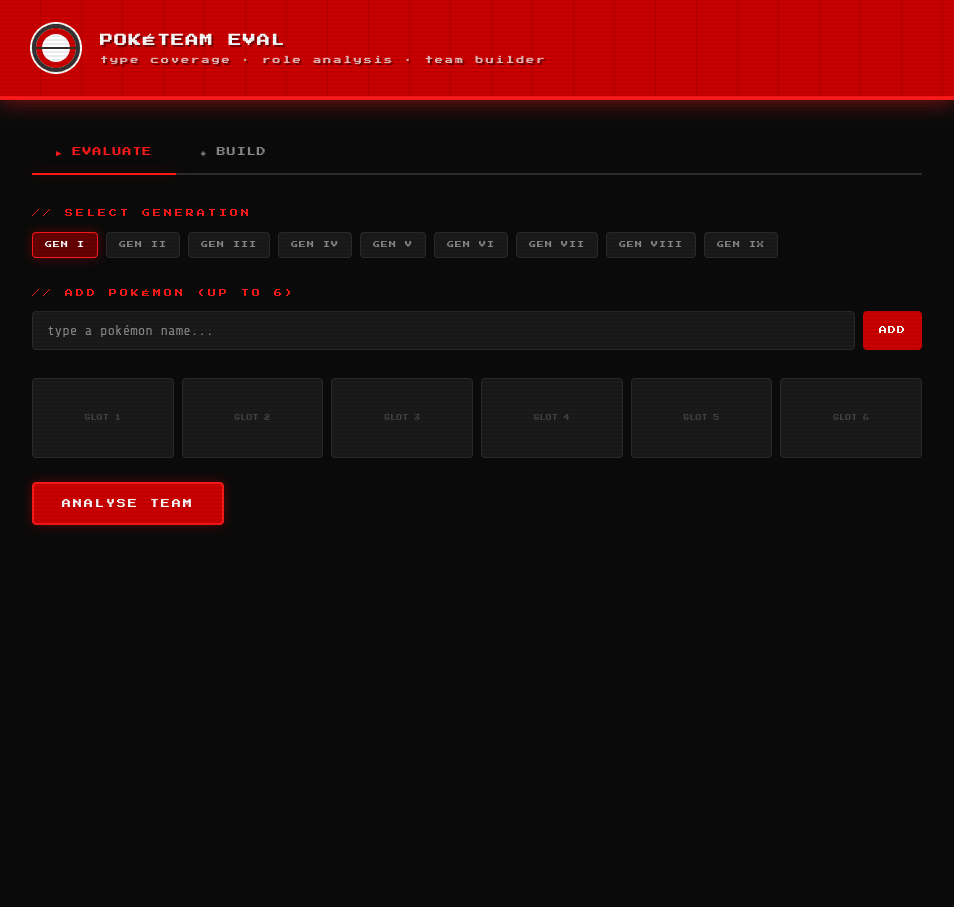
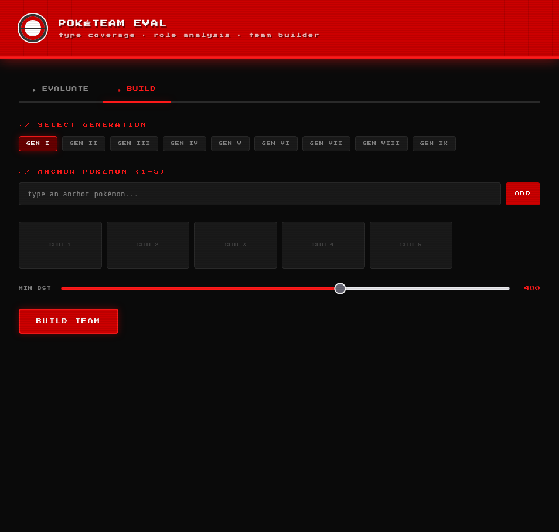

# 🔴 PokéTeam Eval


A Pokémon team analyser and builder for Generations I–IX. Built entirely in Python with a CLI and a web interface.

---

## Features

- **Type Coverage Analysis** — offensive and defensive coverage across all 18 types, with generation-accurate type charts (Gen 1 Ghost/Psychic bug, Fairy added in Gen 6, etc.)
- **Role Distribution** — classifies each Pokémon as Physical Sweeper, Special Wall, Mixed Attacker, etc. and warns about team imbalances
- **Stat Summary** — team averages, highest/lowest per stat, speed tier ranking
- **Rule-based Team Builder** — give it 1–5 anchor Pokémon and it fills the remaining slots by scoring candidates against offensive gaps, defensive gaps, and role balance
- **BST Filter** — `--min-bst` flag lets you control the minimum quality of suggested Pokémon
- **Generation Filter** — only Pokémon available in your chosen generation are considered
- **CLI** — colour terminal output powered by Rich
- **Web UI** — Pokédex-themed dark interface with autocomplete, type badges, coverage grid, and speed tier bars

---

## Screenshots

### Evaluate Tab


### Build Tab


---

## Setup

**1. Clone the repo**
```bash
git clone https://github.com/Besfort21/poke-team-eval.git
cd poke-team-eval
```

**2. Create and activate a virtual environment**
```bash
python -m venv venv
source venv/bin/activate        # Mac/Linux
venv\Scripts\activate           # Windows
```

**3. Install dependencies**
```bash
pip install -r requirements.txt
pip install -e .
```

**4. Fetch Pokémon data** *(one-time, takes 2–4 minutes)*
```bash
python scripts/fetch_data.py
```

---

## CLI Usage

```bash
# Evaluate a team
poke-eval evaluate --gen 1 charizard blastoise venusaur snorlax alakazam machamp

# Build a team around anchors
poke-eval build --gen 4 --anchor garchomp --anchor rotom-wash

# Stricter quality filter
poke-eval build --gen 1 --anchor charizard --min-bst 450

# Output as JSON
poke-eval evaluate --gen 1 --json-out charizard blastoise venusaur

# Re-fetch data cache
poke-eval fetch-data
```

---

## Web Interface

```bash
uvicorn web.app:app --reload
```

Then open `http://localhost:8000` in your browser.

The API is also self-documented at `http://localhost:8000/docs`.

---

## Tech Stack

| Layer | Tool |
|---|---|
| Language | Python 3.11+ |
| CLI | Click + Rich |
| Web backend | FastAPI + Uvicorn |
| Web frontend | Vanilla HTML / CSS / JS |
| Data source | PokéAPI (cached locally) |
| Testing | pytest |
| CI | GitHub Actions |

---

## How the Builder Works

The builder scores every candidate Pokémon in the generation pool against the current team state using four rules applied in priority order:

1. **Offensive gaps** — types the team cannot hit for neutral damage
2. **Defensive gaps** — types that threaten current team members
3. **Role gaps** — missing roles (physical wall, special attacker, etc.)
4. **Type uniqueness** — penalises duplicate type combinations

The highest-scoring candidate is picked for each empty slot and an explanation is generated for each choice.

---

## Running Tests

```bash
pytest tests/ -v
```

28 tests covering type chart edge cases (Gen 1 Ghost/Psychic, Fairy introduction, Steel immunity changes) and evaluator role classification.